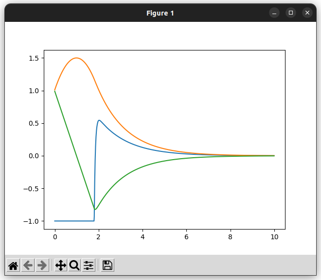
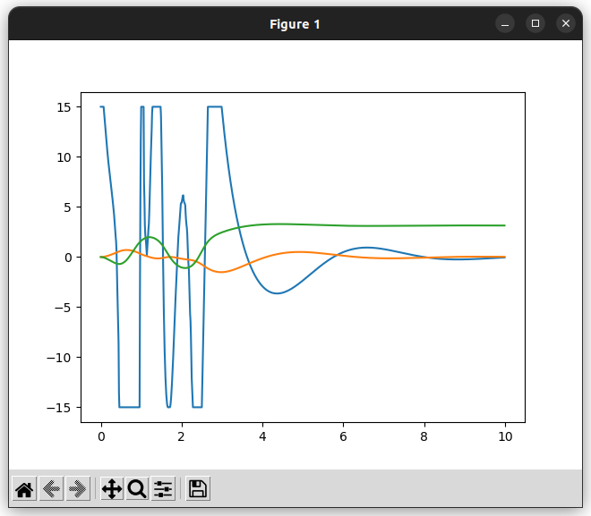

# simple_casadi_mpc

C++からCasADiを用いて簡単な(ここでは上下限以外の制約がないことを指す)MPCを解くためのライブラリ

# 依存関係
- CasADi([インストール用スクリプト例](https://github.com/Kotakku/OptimLibSetupHub/blob/master/CasADi/install_casadi.sh))
- Eigen3
- matplotlib(Example用)

# インストール方法
git cloneして以下を実行
```
mkdir build
cd build
cmake ..
make
sudo make install
```

# Examples
## simple_mpc_example
摩擦がない物体の直動運動のようなもの  
座標1、速度1から開始して座標0に収束させる  



## cartpole_mpc_example
倒立振子の振り上げ  
問題設定は以下のリンクのものを仕様  

https://gist.github.com/mayataka/ef178130d52b5b06d4dd8bb2c8384c54
https://gist.github.com/mayataka/bc08faa63a94d8b48ceba77cc79c7ccc

