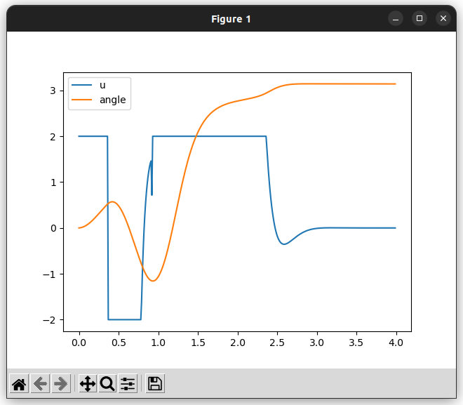
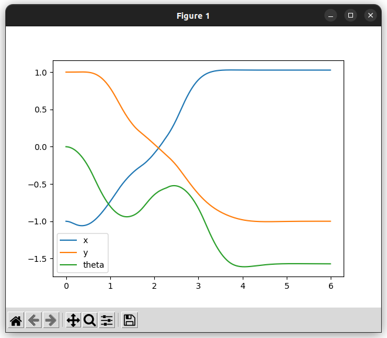

# simple_casadi_mpc

C++からCasADiを用いてMPCを解くためのライブラリ

# 依存関係
- CasADi([インストール用スクリプト例](https://github.com/Kotakku/OptimLibSetupHub/blob/master/CasADi/install_casadi.sh))
- Eigen3
- matplotlib(Example用)

# インストール方法
git cloneして以下を実行
```
mkdir build
cd build
cmake ..
make
sudo make install
```

# MPCソルバークラス
## MPC
実行時にProblemクラスからソルバーを構築し実行する基本的なソルバークラスです。
シンボリック変数の評価のオーバーヘッドが大きいため後述する2つのソルバーよりパフォーマンスは劣りますが手軽に使えるため動作確認などに適しています。

## JITMPC
実行時に最初に内部ソルバーのJITコンパイルを行うソルバークラスです。
シンボリック変数の評価オーバーヘッドなくMPCクラスよりパフォーマンスが高いですが、起動時に数秒〜数十秒のコンパイル分のラグが生じます。(ccacheが使える環境では二回目以降の実行時はビルド時間が短縮されます)
MPCソルバーから置き換えるだけで簡単に使うことができます。
シンボリック変数の評価オーバーヘッドがどの程度パフォーマンスに影響を及ぼしているかを確認する目的のとき、または1回目のタイムラグが許容でき高パフォーマンスなソルバーを用いたいときに適しています。

## CompiledMPC
cmakeマクロを使うことでソースのビルドを行うときに同時に内部ソルバーのビルドも行うことでJITMPCと同等のパフォーマンスを実行時のタイムラグなしに得ることができます。
MPCで解く問題設定設定の仕様やソルバーのパラメータが確定し、とにかく高パフォーマンスなソルバーを使いたい場合に適しています。

### Limitation
CompiledMPCはIPOPTやFATROPといった非線形最適化ソルバーの種類や設定パラメータはビルド時に決定されるため、実行時に動的に変更することはできません。


# Examples
## double_integrator_mpc_example
摩擦がない物体の直動運動のようなもの
座標1、速度1から開始して座標0に収束させる


## cartpole_mpc_example
cartpoleタイプの倒立振子の振り上げ
問題設定は以下のリンクのものを仕様

https://gist.github.com/mayataka/ef178130d52b5b06d4dd8bb2c8384c54
https://gist.github.com/mayataka/bc08faa63a94d8b48ceba77cc79c7ccc


https://github.com/Kotakku/simple_casadi_mpc/assets/25411427/d4d3ffab-cfee-47f4-a080-d1ec638afa4c


## inverted_pendulum_mpc_example
回転軸にモーターがついてるタイプの倒立振子の振り上げ
トルク制約からアームのように振り上げができないように設定してあるため振り上げに助走が入る




https://github.com/Kotakku/simple_casadi_mpc/assets/25411427/8fdee0d8-ef3e-4fd3-b0ae-d3c87431c2a9


## diff_drive_mpc_example
差動二輪で左上から右下まで移動する
その際に円状のオブジェクトの衝突を避けるように制約を追加している



https://github.com/Kotakku/simple_casadi_mpc/assets/25411427/29644ae1-57d9-422b-9fd1-40c99919b0fc
