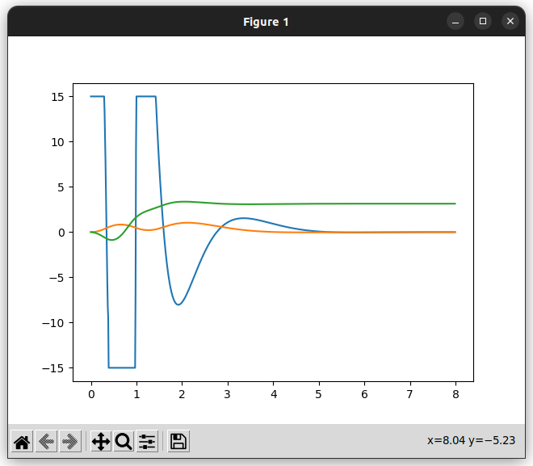
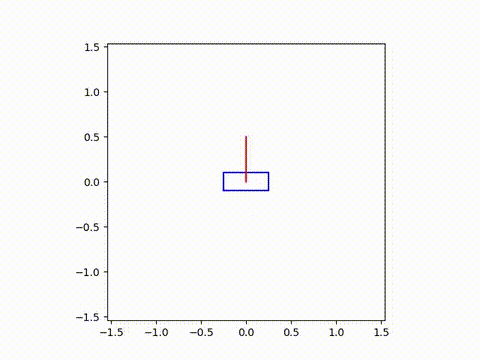
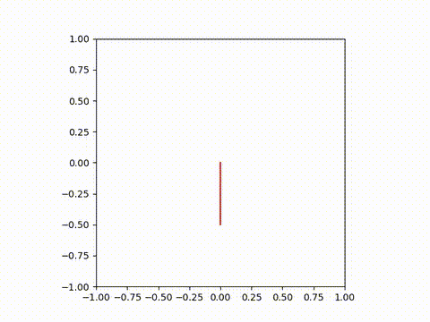
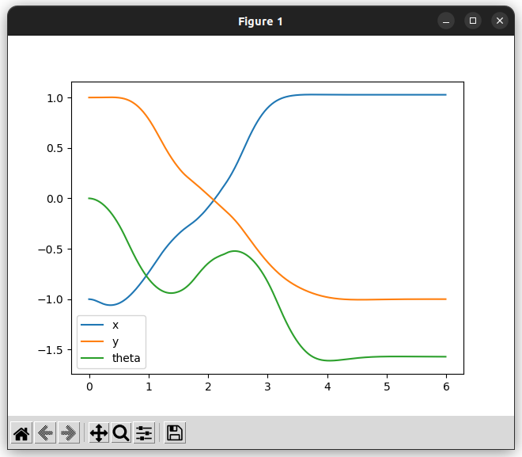
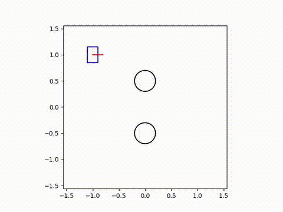
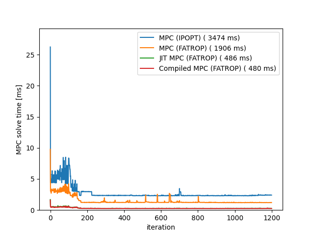

# simple_casadi_mpc

Lightweight C++ utilities for building and solving MPC problems with CasADi. Includes runtime MPC, JIT-compiled MPC, and CMake-integrated compiled MPC solvers.

## Dependencies
- CasADi ([install script example](https://github.com/Kotakku/OptimLibSetupHub/blob/master/CasADi/install_casadi.sh))
- IPOPT or FATROP (optional solver backends)
- Eigen3
- Python3 + NumPy + pybind11
- matplotlibcpp17 (examples/benchmarks use it via pybind11)
- doxygen (for docs; uses `doc/doxygen-awesome-css` submodule)

## Build & install
```bash
mkdir build
cd build
cmake ..
make
sudo make install
```

## CMake usage
```cmake
find_package(simple_casadi_mpc REQUIRED)
target_link_libraries(my_target PRIVATE simple_casadi_mpc)
```

## Solver overview
- `MPC`: simplest runtime solver; easiest for quick validation.
- `JITMPC`: JIT-compiles on the first solve for faster subsequent runs; expect a startup lag (cacheable with ccache).
- `CompiledMPC`: builds solver code at CMake time; best steady-state speed with no runtime lag.

Limitation for `CompiledMPC`: the solver backend (IPOPT/FATROP/...) and its parameters are fixed at build time.

### Usage for CompiledMPC via CMake
```cmake
find_package(simple_casadi_mpc REQUIRED)

# Generate a compiled solver (codegen step happens at build time)
add_simple_casadi_mpc_codegen(
  <solver_target_name>                  # e.g., my_problem
  <codegen_cpp>                         # e.g., my_problem_codegen.cpp (derives Problem)
  EXPORT_SOLVER_NAME <export_name>      # optional, default is <solver_target_name>_compiled_solver
  INCLUDE_DIRS ${CMAKE_CURRENT_SOURCE_DIR} # where your Problem header lives
  SOLVER_NAME <casadi_solver>           # optional; default is fatrop (e.g., ipopt/fatrop/...)
  # LINK_LIBS ...                       # optional; extra solver libs if needed
)

# Link your executable against the generated solver + simple_casadi_mpc
add_executable(<your_exe> main.cpp
                ${<solver_target_name>_COMPILED_SOLVER_CONFIG_SOURCE})
target_include_directories(<your_exe> PRIVATE
  ${CMAKE_CURRENT_SOURCE_DIR} ${<solver_target_name>_CODEGEN_DIR})
target_link_libraries(<your_exe> PRIVATE
  simple_casadi_mpc::simple_casadi_mpc
  ${<solver_target_name>_COMPILED_SOLVER})
```

## Examples
### double_integrator_mpc_example
Drives a frictionless point mass to the origin (position and velocity feedback).

From: [example/double_integrator_mpc_example.cpp](https://github.com/Kotakku/simple_casadi_mpc/blob/main/example/double_integrator_mpc_example.cpp)


### cartpole_mpc_example
Cartpole swing-up and balance (problem setup from the linked gists).

From: [example/cartpole_mpc_example.cpp](https://github.com/Kotakku/simple_casadi_mpc/blob/main/example/cartpole_mpc_example.cpp)

https://gist.github.com/mayataka/ef178130d52b5b06d4dd8bb2c8384c54
https://gist.github.com/mayataka/bc08faa63a94d8b48ceba77cc79c7ccc





### inverted_pendulum_mpc_example
Rotary inverted pendulum swing-up with torque limits that force a multi-phase motion.

From: [example/inverted_pendulum_mpc_example.cpp](https://github.com/Kotakku/simple_casadi_mpc/blob/main/example/inverted_pendulum_mpc_example.cpp)




### diff_drive_mpc_example
Differential-drive robot from top-left to bottom-right while avoiding circular obstacles and respecting velocity limits.

From: [example/diff_drive_mpc_example.cpp](https://github.com/Kotakku/simple_casadi_mpc/blob/main/example/diff_drive_mpc_example.cpp)





## Benchmarks
Runtime comparisons for cartpole MPC solver variants.




## Documentation
1) Fetch submodules:
```bash
git submodule update --init --recursive
```
2) Generate docs:
```bash
cd doc
doxygen Doxyfile
```
3) Open `doc/build/html/index.html`.
