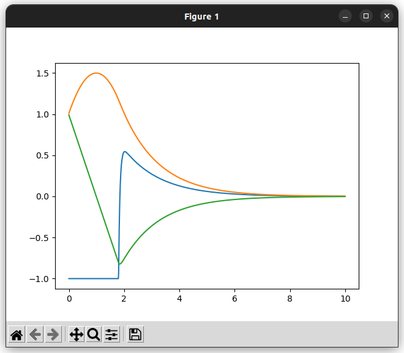
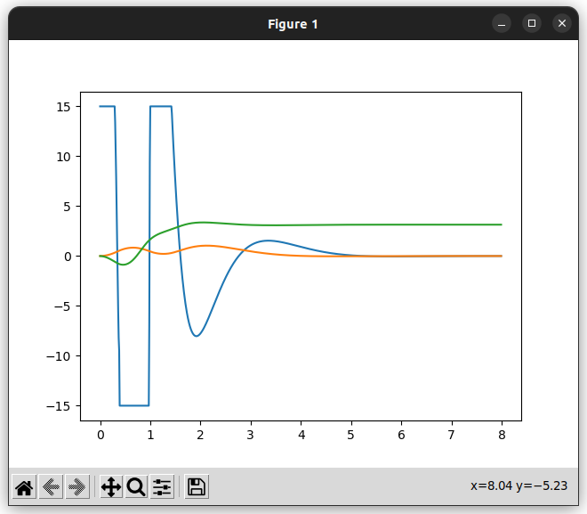
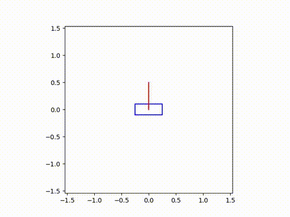
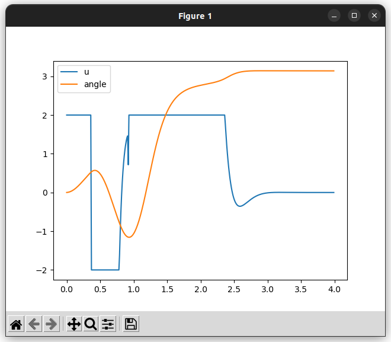
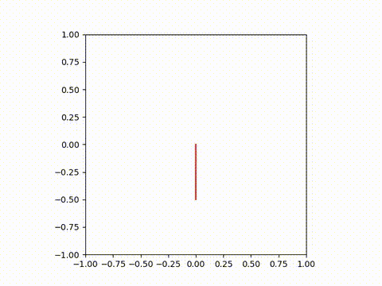
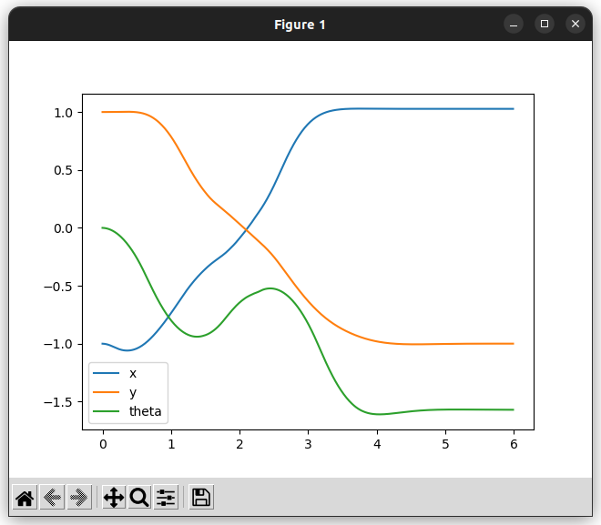
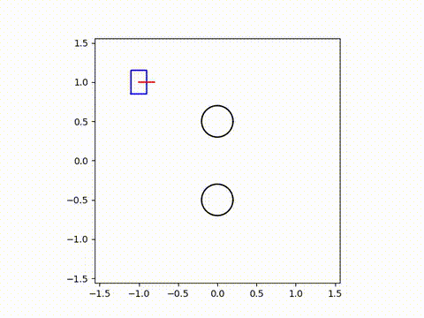
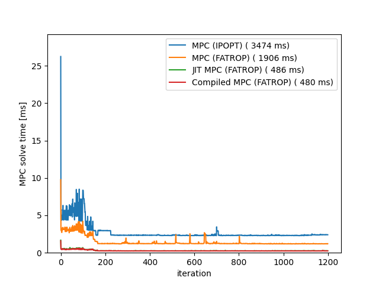
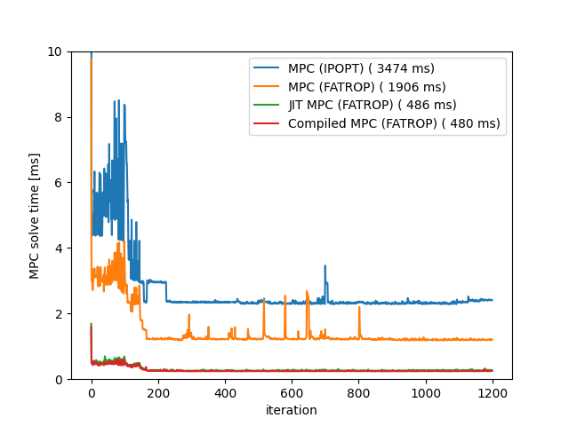
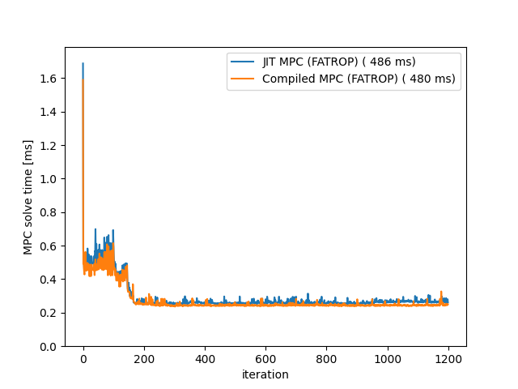

# simple_casadi_mpc

[](https://github.com/Kotakku/simple_casadi_mpc/actions/workflows/build.yml)
[](https://github.com/Kotakku/simple_casadi_mpc/actions/workflows/docs.yml)

Lightweight C++ utilities for building and solving MPC problems with CasADi. Includes runtime MPC, JIT-compiled MPC, and CMake-integrated compiled MPC solvers.

## Dependencies

- CasADi ([install script](install_casadi.sh))
- IPOPT or FATROP (optional solver backends)
- Eigen3
- Python3 + NumPy + pybind11
- matplotlibcpp17 (examples/benchmarks use it via pybind11)
- doxygen (for docs; uses `doc/doxygen-awesome-css` submodule)

## Build & install

```bash
mkdir build
cd build
cmake ..
make
sudo make install
```

## CMake usage

```cmake
find_package(simple_casadi_mpc REQUIRED)
target_link_libraries(my_target PRIVATE simple_casadi_mpc)
```

## Solver overview

- `MPC`: simplest runtime solver; easiest for quick validation.
- `JITMPC`: JIT-compiles on the first solve for faster subsequent runs; expect a startup lag (cacheable with ccache).
- `CompiledMPC`: builds solver code at CMake time; best steady-state speed with no runtime lag.

Limitation for `CompiledMPC`: the solver backend (IPOPT/FATROP/...) and its parameters are fixed at build time.

## Problem format

Define your MPC problem by deriving from `simple_casadi_mpc::Problem` and overriding `dynamics`, `stage_cost`, and (optionally) `terminal_cost`:

```cpp
#include "simple_casadi_mpc/simple_casadi_mpc.hpp"

class MyProblem : public simple_casadi_mpc::Problem {
public:
  MyProblem()
      // DynamicsType, nx, nu, horizon (N), dt
      : Problem(DynamicsType::ContinuesRK4, /*nx=*/2, /*nu=*/1, /*N=*/20, /*dt=*/0.05) {
    // Optional: per-stage input/state bounds
    set_input_bound(Eigen::VectorXd::Constant(1, -1.0),
                    Eigen::VectorXd::Constant(1,  1.0));
    // Optional: runtime-tunable parameters (updated each `solve` call)
    x_ref_ = reference_trajectory("x_ref"); // shape (nx, N)
  }

  // Continuous dynamics: return dx/dt for {ContinuesForwardEuler|ContinuesModifiedEuler|ContinuesRK4}
  // Discrete dynamics:   return x_{k+1} for {Discretized}
  casadi::MX dynamics(casadi::MX x, casadi::MX u) override {
    return casadi::MX::vertcat({x(1), u});
  }

  // Per-stage cost. `k` is the stage index in [0, horizon).
  casadi::MX stage_cost(casadi::MX x, casadi::MX u, size_t k) override {
    casadi::MX e = x - x_ref_(casadi::Slice(), k);
    return casadi::MX::mtimes(e.T(), e) + 0.1 * casadi::MX::mtimes(u.T(), u);
  }

  // Terminal cost on x_N (default returns 0 if not overridden).
  casadi::MX terminal_cost(casadi::MX x) override {
    return 10.0 * casadi::MX::mtimes(x.T(), x);
  }

private:
  casadi::MX x_ref_;
};
```

Solve loop:

```cpp
auto prob = std::make_shared<MyProblem>();
simple_casadi_mpc::MPC mpc(prob); // or JITMPC / CompiledMPC

Eigen::VectorXd x = /* initial state */;
for (...) {
  // Update parameters declared via `parameter(...)` / `reference_trajectory(...)`
  casadi::DM x_ref_dm = /* (nx, N) DM */;
  Eigen::VectorXd u = mpc.solve(x, {{"x_ref", x_ref_dm}});
  x = prob->simulate(x, u, sim_dt);
}
```

Hard and soft path constraints (`g(x, u) <= 0` or `= 0`) can be added with `add_constraint` / `soft_add_constraint`; see below.

### Usage for CompiledMPC via CMake

```cmake
find_package(simple_casadi_mpc REQUIRED)

# Generate a compiled solver (codegen step happens at build time)
add_simple_casadi_mpc_codegen(
  <solver_target_name>                  # e.g., my_problem
  <codegen_cpp>                         # e.g., my_problem_codegen.cpp (derives Problem)
  EXPORT_SOLVER_NAME <export_name>      # optional, default is <solver_target_name>_compiled_solver
  INCLUDE_DIRS ${CMAKE_CURRENT_SOURCE_DIR} # where your Problem header lives
  SOLVER_NAME <casadi_solver>           # optional; default is fatrop (e.g., ipopt/fatrop/...)
  # LINK_LIBS ...                       # optional; extra solver libs if needed
)

# Link your executable against the generated solver + simple_casadi_mpc
add_executable(<your_exe> main.cpp
                ${<solver_target_name>_COMPILED_SOLVER_CONFIG_SOURCE})
target_include_directories(<your_exe> PRIVATE
  ${CMAKE_CURRENT_SOURCE_DIR} ${<solver_target_name>_CODEGEN_DIR})
target_link_libraries(<your_exe> PRIVATE
  simple_casadi_mpc::simple_casadi_mpc
  ${<solver_target_name>_COMPILED_SOLVER})
```

## Examples

### double_integrator_mpc_example

Drives a frictionless point mass to the origin (position and velocity feedback).

From: [example/double_integrator_mpc_example.cpp](https://github.com/Kotakku/simple_casadi_mpc/blob/main/example/double_integrator_mpc_example.cpp)



### cartpole_mpc_example

Cartpole swing-up and balance (problem setup from the linked gists).

From: [example/cartpole_mpc_example.cpp](https://github.com/Kotakku/simple_casadi_mpc/blob/main/example/cartpole_mpc_example.cpp)

<https://gist.github.com/mayataka/ef178130d52b5b06d4dd8bb2c8384c54>
<https://gist.github.com/mayataka/bc08faa63a94d8b48ceba77cc79c7ccc>





### inverted_pendulum_mpc_example

Rotary inverted pendulum swing-up with torque limits that force a multi-phase motion.

From: [example/inverted_pendulum_mpc_example.cpp](https://github.com/Kotakku/simple_casadi_mpc/blob/main/example/inverted_pendulum_mpc_example.cpp)





### diff_drive_mpc_example

Differential-drive robot from top-left to bottom-right while avoiding circular obstacles and respecting velocity limits.

From: [example/diff_drive_mpc_example.cpp](https://github.com/Kotakku/simple_casadi_mpc/blob/main/example/diff_drive_mpc_example.cpp)





### diff_drive_soft_constraint_example

Same diff-drive setup with a single circular obstacle, comparing `add_constraint` (hard) and `soft_add_constraint` (soft) for the obstacle. With a large penalty weight the soft formulation matches the hard one; with a small weight the optimizer prefers cutting through the obstacle if the tracking gain dominates the violation cost.

From: [example/diff_drive_soft_constraint_example.cpp](https://github.com/Kotakku/simple_casadi_mpc/blob/main/example/diff_drive_soft_constraint_example.cpp)

## Soft constraints

`Problem::soft_add_constraint(type, func, w1, w2)` introduces non-negative per-stage slack variables `s ≥ 0` and adds `w1 · 1ᵀs + 0.5 · w2 · sᵀs` to the cost.

- Inequality `g(x,u) ≤ 0` becomes `g − s ≤ 0`.
- Equality `h(x,u) = 0` becomes `|h| ≤ s`, encoded as `h − s ≤ 0` and `−h − s ≤ 0`.

The default `w2 = 0` gives a pure L1 (exact) penalty; setting `w2 > 0` adds an L2 (smooth) term. Large `w1` recovers hard-constraint behavior; small `w1` allows the optimizer to trade violation against the rest of the cost. Hard `add_constraint` and soft `soft_add_constraint` can be mixed on the same problem.

## Tips

### Choosing a solver backend

| Backend | Default config             | Best for                                          |
| ------- | -------------------------- | ------------------------------------------------- |
| IPOPT   | `default_ipopt_config()`   | General-purpose NLP; default and easiest to debug |
| FATROP  | `default_fatrop_config()`  | OCP-structured problems; fastest for MPC          |
| qpOASES | `default_qpoases_config()` | SQP method backed by qpOASES (linear-quadratic)   |

Pass a copy of one of these dicts as the third argument to `MPC` / `JITMPC`, mutating any keys you need:

```cpp
auto cfg = simple_casadi_mpc::MPC::default_fatrop_config();
cfg["fatrop.max_iter"] = 100;
simple_casadi_mpc::MPC mpc(prob, "fatrop", cfg);
```

FATROP requires CasADi to be built with `WITH_FATROP=ON` and `WITH_BLASFEO=ON`; see [`install_casadi.sh`](install_casadi.sh).

### Picking `MPC` vs `JITMPC` vs `CompiledMPC`

- Reach for `MPC` while iterating on the problem itself; no compile step.
- Switch to `JITMPC` once the model is stable. The first `solve` triggers a `gcc -O3 -march=native` compile; cache it with `ccache` (the default `default_jit_options()` already does so).
- Use `CompiledMPC` (with the `add_simple_casadi_mpc_codegen` CMake helper) when you want zero runtime startup cost and the solver backend is fixed.

### Customizing JIT compile options

Override the defaults from `JITMPC::default_jit_options()`:

```cpp
auto opts = simple_casadi_mpc::JITMPC::default_jit_options();
opts["compiler"] = "clang";
opts["flags"] = "-O2 -fno-fast-math";
opts["verbose"] = true;
simple_casadi_mpc::JITMPC mpc("my_prob", prob, "ipopt",
                               simple_casadi_mpc::MPC::default_ipopt_config(),
                               opts);
```

### Runtime-tunable parameters

`Problem::parameter(name, rows, cols)` returns a symbolic MX; update it at each solve:

```cpp
mpc.solve(x, {{"x_ref", x_ref_dm}, {"obstacle", obs_dm}});
```

`reference_trajectory(name)` is a shorthand for `parameter(name, nx, horizon)` whose column `k` is consumed at stage `k`.

### Performance knobs (`MPC` / `JITMPC` config)

Two simple-casadi-mpc-specific options can be passed in the config dict (consumed before being forwarded to CasADi):

- `mapsum_stage_cost` (default `true`): build the stage-cost sum via MapSum so first-order AD stays loop-shaped.
- `expand_inner_functions` (default `true`): SX-expand per-stage F/L/G before mapping for faster JIT compilation.

Both default to `true`. If your `stage_cost` has stage-dependent branching beyond per-stage parameter slicing, the library auto-falls-back to a per-stage loop (warning emitted) and you can also set `mapsum_stage_cost = false` explicitly.

### Warm starting

`MPC::solve` caches the previous `x`, `lam_x`, `lam_g` internally and feeds them to the next solve, so closed-loop simulations naturally benefit. Solver-side warm start is also enabled in `default_ipopt_config()` (`ipopt.warm_start_init_point = "yes"`).

## Benchmarks

Runtime comparisons for cartpole MPC solver variants.







## Documentation

1. Fetch submodules:

```bash
git submodule update --init --recursive
```

1. Generate docs:

```bash
cd doc
doxygen Doxyfile
```

1. Open `doc/build/html/index.html`.
